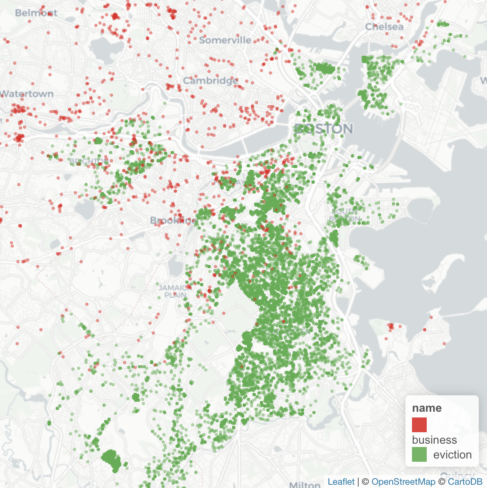
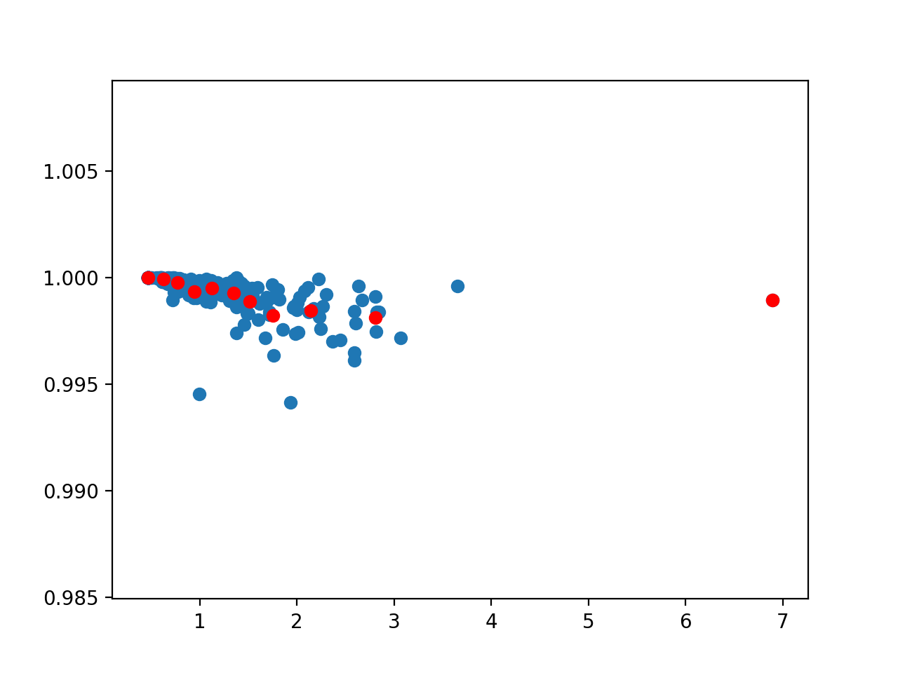

### Lubov McKone and Anna Goncharova: Final Report

## Purpose

Boston is a growing city characterized by both rapid economic growth and, increasingly, housing instability. Our analysis takes a look at potential relationships between businesses and housing instability in the City of Boston. After retireving data on eviction, crime, businesses, and income and aggregating them by census tract, we were able to take a closer look at the relationships between our variables of interest. Using the insight gained from our analysis, we created a mock optimization that finds placements of businesses that minimize the overall increase in housing instability that they could potentially cause. We also built a web service that allows a user to interactively explore our data. 

### Data Retrieval

1. **Businesses**

	We queried the [Foursquare API](https://developer.foursquare.com/docs) to get data about businesses in Boston. To work around Foursquare's query limit of 50 data points per request, we created a lattice of longitute and latitude points. We preserved unique data points returned with our query for "Office" and different longitute and latitude pairs. In total, we were able to retrieve 1478 data points. 

2. **Permits**
	
	We gathered [permit data](https://data.boston.gov/dataset/approved-building-permits) using the Analyze Boston CKAN API. This data contains information about approved changes to the built environment such as new constructions, additions, and remodeling.

3. **Evictions**
	
	We collaborated with the City of Boston Office of Housing Stability to retrieve [eviction data](http://datamechanics.io/data/evictions_boston.csv) for Boston from 2014-2016. 

4. **Crime**

	We gathered [crime data](https://data.boston.gov/dataset/crime-incident-reports-august-2015-to-date-source-new-system) using the Analyze Boston CKAN API.

5. **Income**

	We used the [Census Data API python wrapper](https://github.com/datamade/census) to retrieve median income by census tract in Massachusetts. We then filtered for the Suffolk Count FIPS code, representing census tracts in Boston. 

6. **Census Tracts**

	We retrieved the census tract [shapefile for Massachusetts](https://www.census.gov/cgi-bin/geo/shapefiles/index.php) and filtered it for Boston. We used QGIS to convert it into a GeoJSON file which we retrieved from [datamechanics.io](http://datamechanics.io/data/boston_tracts_3.json).

## Analysis

### Aggregation and Scoring

After gathering our data, we utlized the [Shapely](https://toblerity.org/shapely/manual.html) library to aggregate the lat-long data we retrieved for evictions, crimes, businesses, and income by the census tract polygons. The function we implemented essentially identifies whether a lat-long point (representing an eviction, a business, etc.) falls within the lat-long boundaries of a given census tract. We wrapped this shapely function into a MapReduce-style algorithm that appends a tuple containg the census tract FIPS code and a 1 when it identifies which tract the point falls within. We then aggregate these over the census tract FIPS code and use a combination of selections and projection to 'join' the counts of evictions, crimes, and businesses to the GeoJSON file, inserting them as fields within the 'properties' dictionary associated with each tract. 

We also joined the income field that we retrieved from the Census Data API to the GeoJSON file through a simple project and selection on the GEOID field. 

Having a measure of the count of evictions, crimes, businesses, and median income for each tract, we created a normalized "stability score" that measures the housing instability of a given census tract using the indicators noted as significant in [this paper](https://www.sciencedirect.com/science/article/pii/S0049089X16300977) by housing scholar Matthew Desmond (eviction rate and crime rate). Note that although we call our metric the "stability score," it actually measures INstability.

To get a sense of the most housing-unstable areas of the city, we created a Leaflet map of stability score by census tract, which we included on our server in addition to our interactive visualizations.

### Statistical Analysis

We quickly visualized evictions, businesses, and crime on a map to get a sense of their distribution around the City:

**Crimes, Evictions, and Businesses**

**Evictions and Businesses**

To investigate the relationships within our data, we ran some basic correlations. We found that businesses has a 0.1 correlation with stability score (p=0.14), a detail we used in our optimization. 

We were also curious whether the relationship between number of businesses and number of evictions in a given census tract changes given the median income of that census tract. To investigate this, we found the quartiles of the distribution of median incomes of each census tract. We then partitioned the data into four segements representing different income levels - low income, low-medium income, high-medium income, and high income. 

Interestingly, we found that the correlation between number of businesses and number of evictions was small and negative for the lowest three income grades. However, the correlation between business and evictions in the high income census tracts was 0.21. 

This indicates that the interaction between businesses and evictions changes based on the demographic of a geographic area. 

We ran these same "partitioned correlations" for businesses and instability and evictions and instability and visualized the differences on our web service.

### Optimization

### K-means
We ran k-means on the following combinations of data points: evictions and stability score, crime and stability score, crime and evictions and stability.
We found that our data isn't highly segregated into particular pockets, so we learned that our data is evenly distributed. 

Here is a graph of a result of performing k-means on crime and eviction and stability score combination, with 11 clusters.

### SMT 
In order to see whether it would be possible to gain insights into the relationships between the stability score and the number of businesses in a particular Boston-area census tract, we computed the correlation statistic on the "# of businesses" and "stability score". We found that the correlation was 0.1 (p=0.14). This correlation is small and not statistically significant at the 0.05 level, so the results of the optimization should be interpreted with caution since they assume that adding a business to a census tract increases its stabiity score by 0.1. 
We implemented an SMT solver using the z3 library to compute the "optimal score". We invented an algorithm for computing the optimal score for a tract. The way it works is that we constrain the number of businesses it would be possible to add to the city. Then we assign a specific weight that a single businesses added might have on the stability score. Then we use the minimize function of the Optimize z3 object to find the minimized optimal score from the stability score.

## Web Service

We built a server that allows a user to explore the geography of stability and how income mediates the correlation between business activity and housing stability through a d3 chart. We also included a d3 map that allows the user to view how the geography of evictions has changed over time.

## Future Work

One thing that would have been extremely useful to us during this project is a data source of businesses by the year they opened. This would have allowed us to more robustly explore the relationship between evictions and businesses by allowing us to consider the timing of business entrances into certain areas rather than merely their presence. The FourSquare data set we retrieved gave us the location of businesses, but no information about when they got there. We think this would have made our correlations and optimization more meaningful and allowed us to better answer our question about the relationship between business activity and evictions.

If we could continue to work on this project, we might also try to customize the instability metric to Boston - we could create a regression or other type of model that could allow us to formalize the factors that are associated with future evictions. The paper we used to help us decide what to include in the stability score was based on an analysis done in Milwaukee, so it might be interesting and more useful to investigate what is associated with evictions here in Boston. 

* *note:* in order to run optimal_score.py, you will need to replace `sys.path.append("/Users/lubovmckone/course-2018-spr-proj/agoncharova_lmckone/z3/build/python/")` in with your own path to the z3/build/python folder

## Website README

To start the server, run the following from where `server.py` file is located (this directory):

`export FLASK_APP=server.py && python3 -m flask run` 

You might need to change `python3` to your respective version of python.

Tutorials for the graphs:
1. [Correlations Chart](https://bl.ocks.org/mbostock/4061961)
2. [Evictions Map](http://duspviz.mit.edu/d3-workshop/mapping-data-with-d3/)
 
